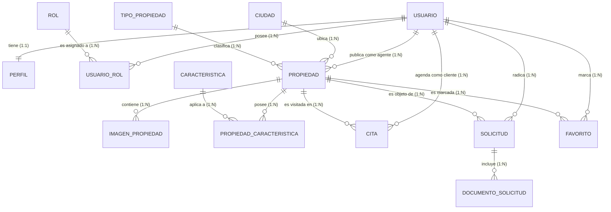

# Modelo Relacional y Entidad-Relación (MER)

## Modelo Relacional en 3FN

El modelo cumple con la Tercera Forma Normal (3FN):
1. **1FN:** No hay grupos repetidos. Los atributos multivaluados (ej. características de propiedad, roles múltiples, imágenes) se separaron en las tablas `propiedad_caracteristica`, `usuario_rol` e `imagen_propiedad`.
2. **2FN:** Todas las tablas con llaves compuestas (`usuario_rol`, `propiedad_caracteristica`) dependen completamente de la llave compuesta, sin dependencias parciales.
3. **3FN:** No existen dependencias transitivas. Por ejemplo, el nombre de la ciudad o del tipo de propiedad no están en la tabla `propiedad`, sino en catálogos separados referenciados por FK.

### Diagrama MER (Mermaid)

